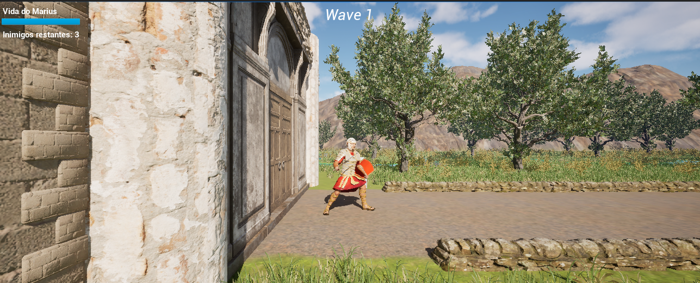

# O Último Praesidium

(Screenshots/Gameplay.png)

A Tower Defense game developed as a Computer Science Final Year Project using Unreal Engine 5.

---

## About the Project

**O Último Praesidium** is a Tower Defense game set in Ancient Rome, where the player must defend their position against successive waves of enemies.

The project was developed as part of a Computer Science undergraduate thesis, focusing on game development, gameplay systems, artificial intelligence, user interface design, testing, debugging, and technical documentation.

---

## Key Features

- Enemy wave system
- AI-controlled enemies
- Tower defense mechanics
- Combat and damage systems
- Dynamic HUD and game status indicators
- Victory and defeat conditions
- Ancient Rome themed environment
- Gameplay balancing and testing

---

## Technologies Used

- Unreal Engine 5
- Blueprint Visual Scripting
- Blender
- Git & GitHub

---

## Development Highlights

During development, several gameplay and technical systems were designed, implemented, tested, and refined, including:

- Enemy pathfinding and navigation
- Wave management system
- Combat interactions
- User Interface (HUD)
- Collision and hit detection systems
- Gameplay debugging and bug fixing
- Performance and gameplay testing

---

## Screenshots

### Gameplay

### Combat System

### HUD

---

## Gameplay Video

Watch the gameplay demonstration here:

[Gameplay Video](https://youtu.be/vA2jwyk1D-4?si=Z3oh6WAgFZBQ6eEV)

---

## Documentation

📄 [Monograph](Documentation/RAPHAEL_DOS_SANTOS_RIBEIRO_SILVA_VFINAL.pdf)

📄 [Game Design Document (GDD)](Documentation/O_Ultimo_Praesidium-GDD)

---

## Academic Context

This project was developed as part of the requirements for obtaining a Bachelor's Degree in Computer Science and represents the complete development cycle of a game project, from planning and design to implementation, testing, documentation, and final presentation.

---

## Author

**Raphael dos Santos Ribeiro Silva**

Computer Science Student
